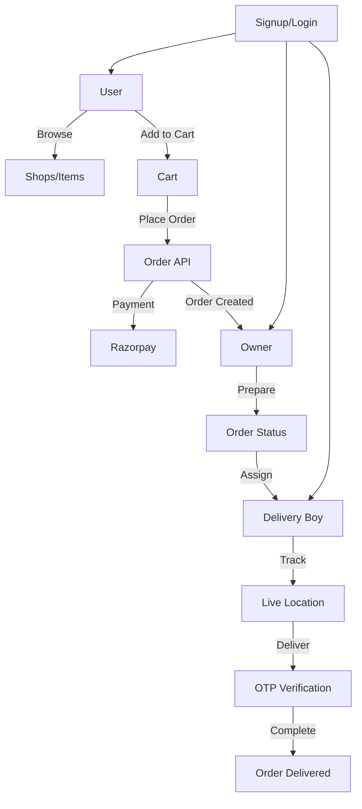

# Food Delivery App

A full-stack food delivery platform built with React (Vite) for the frontend and Node.js/Express/MongoDB for the backend. It supports user, owner, and delivery boy roles, real-time order tracking, and online payments via Razorpay.

---

## Table of Contents

- [System Architecture](#system-architecture)
- [Database Design](#database-design)
- [API Endpoints](#api-endpoints)
- [Application Flow Diagram](#application-flow-diagram)
- [Frontend Overview](#frontend-overview)
- [Backend Overview](#backend-overview)
- [Setup Instructions](#setup-instructions)

---

## System Architecture

- **Frontend**: React (Vite), Redux, Axios, Socket.IO-client
- **Backend**: Node.js, Express, Socket.IO, MongoDB (Mongoose), Razorpay
- **Real-time**: Order status, delivery tracking via Socket.IO

---

## Database Design

### User

| Field         | Type      | Description                       |
|---------------|-----------|-----------------------------------|
| fullName      | String    | User's full name                  |
| email         | String    | Unique email                      |
| password      | String    | Hashed password                   |
| mobile        | String    | Mobile number                     |
| role          | String    | 'user', 'owner', 'deliveryBoy'    |
| location      | GeoJSON   | Current location (deliveryBoy)    |
| orders        | [Order]   | List of order references          |
| isOnline      | Boolean   | Delivery boy online status        |
| socketId      | String    | For real-time updates             |

### Shop

| Field         | Type      | Description                       |
|---------------|-----------|-----------------------------------|
| name          | String    | Shop name                         |
| image         | String    | Shop image URL                    |
| city/state    | String    | Location                          |
| address       | String    | Address                           |
| owner         | User      | Owner reference                   |
| items         | [Item]    | Food items                        |

### Item

| Field         | Type      | Description                       |
|---------------|-----------|-----------------------------------|
| shop          | Shop      | Shop reference                    |
| name          | String    | Item name                         |
| price         | Number    | Price                             |
| category      | String    | Food category                     |
| image         | String    | Image URL                         |
| availability  | Boolean   | Is available                      |
| rating        | Object    | {average, count}                  |
| type          | String    | 'veg'/'non veg'                   |

### Order

| Field         | Type      | Description                       |
|---------------|-----------|-----------------------------------|
| user          | User      | Customer reference                |
| address       | Object    | Delivery address                  |
| paymentMethod | String    | 'cod'/'online'                    |
| totalAmount   | Number    | Total price                       |
| shopOrders    | [ShopOrder]| Orders per shop                  |
| payment       | Boolean   | Payment status                    |
| razorpayOrderId| String   | Razorpay order id                 |
| razorpayPaymentId| String | Razorpay payment id               |

### ShopOrder (Embedded in Order)

| Field         | Type      | Description                       |
|---------------|-----------|-----------------------------------|
| shop          | Shop      | Shop reference                    |
| owner         | User      | Owner reference                   |
| items         | [OrderItem]| Items in this shop order         |
| subtotal      | Number    | Subtotal for shop                 |
| status        | String    | 'pending', 'preparing', ...       |
| assignedDeliveryBoy | User| Delivery boy reference            |
| assignment    | DeliveryAssignment | Assignment reference      |
| deliveryOtp   | String    | OTP for delivery confirmation     |
| deliveredAt   | Date      | Delivery timestamp                |

### DeliveryAssignment

| Field         | Type      | Description                       |
|---------------|-----------|-----------------------------------|
| order         | Order     | Order reference                   |
| shop          | Shop      | Shop reference                    |
| shopOrderId   | ShopOrder | ShopOrder reference               |
| broadcastedTo | [User]    | Candidate delivery boys           |
| assignedTo    | User      | Assigned delivery boy             |
| status        | String    | 'broadcasted', 'assigned', ...    |
| acceptedAt    | Date      | Assignment acceptance time        |

---

## API Endpoints

### Auth

- `POST /api/auth/signup` - Register user/owner/deliveryBoy
- `POST /api/auth/signin` - Login
- `GET /api/auth/signout` - Logout
- `POST /api/auth/googleauth` - Google OAuth
- `POST /api/auth/sendotp` - Send OTP for password reset
- `POST /api/auth/verifyotp` - Verify OTP
- `POST /api/auth/resetpassword` - Reset password

### User

- `GET /api/user/current` - Get current user profile
- `POST /api/user/update-location` - Update user location
- `GET /api/user/search-items` - Search food items

### Shop

- `GET /api/shop/getall` - Get all shops
- `GET /api/shop/getcurrent` - Get current user's shop
- `POST /api/shop/editshop` - Add/Edit shop
- `GET /api/shop/getshopsbycity/:city` - Get shops by city
- `GET /api/shop/getshopbyid/:shopId` - Get shop by ID

### Item

- `GET /api/item/getitemsbyshop/:shopId` - Get items by shop
- `GET /api/item/getitemsbycity/:city` - Get items by city
- `POST /api/item/additem` - Add item
- `POST /api/item/edititem/:itemId` - Edit item
- `GET /api/item/delete/:itemId` - Delete item
- `GET /api/item/getbyid/:itemId` - Get item by ID

### Order

- `POST /api/order/placeorder` - Place order (COD/Online)
- `POST /api/order/verify-razorpay` - Verify Razorpay payment
- `GET /api/order/getmy` - Get user's orders
- `GET /api/order/shop-orders` - Get owner's orders
- `POST /api/order/update-order-status/:orderId/:shopId` - Update order status
- `GET /api/order/getassignments` - Get delivery boy assignments
- `GET /api/order/accept-assignment/:assignmentId` - Accept assignment
- `GET /api/order/current-order` - Get current order for delivery boy
- `POST /api/order/update-location` - Update delivery boy location
- `GET /api/order/delivery-location/:orderId/:shopOrderId` - Get delivery boy location
- `POST /api/order/send-otp` - Send delivery OTP
- `POST /api/order/verify-otp` - Verify delivery OTP
- `GET /api/order/stats/today` - Get today's delivery stats
- `GET /api/order/stats/month` - Get monthly delivery stats
- `GET /api/order/my-delivered-orders` - Get delivered orders
- `GET /api/order/my-location` - Get delivery boy location
- `GET /api/order/:orderId` - Get order by ID

---

## Authentication & Access Control

All users (customers, shop owners, delivery boys) must sign up and log in to access the application features. Authentication is enforced for all API endpoints and UI routes:

- **Sign Up / Login Required**: 
	- Users must create an account or log in to browse shops, add to cart, place orders, and track deliveries.
	- Owners must log in to manage their shop, menu, and orders.
	- Delivery boys must log in to view assignments and update delivery status.
- **Session Management**: Authentication is handled via secure cookies and JWT tokens. Protected routes and API endpoints require a valid session.
- **Access Control**: Role-based access ensures only authorized users can perform specific actions (e.g., only owners can add/edit shops/items, only delivery boys can accept assignments).

If a user is not authenticated, they are redirected to the login/signup page and cannot access any protected features.

## Application Flow Diagram

---

## Frontend Overview

- **UserDashboard**: Browse categories, shops, items, search, add to cart, place orders, track orders.
- **OwnerDashboard**: Manage shop, add/edit items, view orders, update order status, assign delivery.
- **DeliveryBoy**: View assignments, accept orders, update live location, mark delivery via OTP.

---

## Backend Overview

- **Express.js** REST API with modular routes/controllers.
- **Socket.IO** for real-time updates (order status, delivery tracking).
- **MongoDB** for data storage (users, shops, items, orders, assignments).
- **Razorpay** for online payments.

---

## Setup Instructions

1. **Clone the repository**
2. **Install dependencies**
	- Backend: `cd backend && npm install`
	- Frontend: `cd frontend && npm install`
3. **Configure environment variables**
	- Backend: `.env` for DB, Razorpay keys, etc.
4. **Start servers**
	- Backend: `npm start`
	- Frontend: `npm run dev`
5. **Access the app**
	- Frontend: `http://localhost:5173`
	- Backend: `http://localhost:5000`

---

## Contribution

Feel free to fork and contribute! For major changes, please open an issue first.

---

